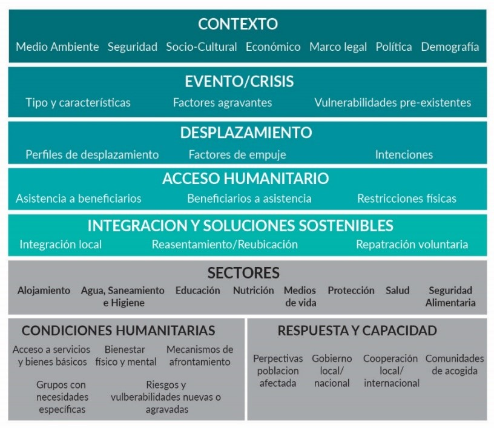

```{r options_communes, include=FALSE}
source("options_communes.R")
```


<div class="important">
Realizar un plan de análisis desde el principio, asignando suficiente tiempo y recursos para ejercicios de análisis, como talleres de análisis conjuntos, análisis multisectorial y escalas de severidad.
</div>


## Definir necesidades de información 

Los socios de la evaluación deberán definir qué información necesitan recolectar basándose en el objetivo de la evaluación, las decisiones que se quieren informar y el resto de los parámetros definidos en la sección 4.1. Por ejemplo, teniendo en cuenta los parámetros de nuestro escenario, las necesidades de información a definir estarán relacionadas con las necesidades multisectoriales de las poblaciones objetivo, dentro de los departamentos seleccionados, junto con información de la respuesta ya implementada y la capacidad existente en terreno tanto por parte del gobierno como de las organizaciones locales e internacionales presentes, o con capacidad para responder en el área.

Una vez definida una lista inicial de necesidades de información, se deberá revisar la información existente en informes de situación disponibles, evaluaciones de necesidades y otros documentos relevantes para identificar la información que ya es conocida y la que no lo es.

En la siguiente sección se introduce una metodología que ayuda a guiar el proceso de definición de necesidades de información a través de un marco de análisis.

### Marco analítico regional

Las necesidades de información se pueden detallar y estructurar de diferentes formas, y un método común es la utilización de un marco analítico. Este método ayuda a hacer un seguimiento de que datos deben ser recopilados, recolectados y de cómo analizarlos.

El marco organiza todas las necesidades de información en diferentes categorías y subcategorías y muestra las relaciones entre conceptos clave. Además, ayuda a identificar vacíos de información y muestra cómo evolucionan las necesidades de información a lo largo del tiempo.

El marco analítico propuesto en la Ilustración 1, está basado en el trabajo global realizado como parte del desarrollo del MIRA y el JIAG, y ha sido contextualizado para cumplir con las necesidades de información de la crisis de Venezuela. Desde el comienzo de 2019 ha sido utilizado para apoyar revisiones de datos secundarios y análisis de datos.

_Ilustración 1. Marco de análisis_



El marco contempla por un lado información de contexto, de la crisis, perfiles de desplazamiento, acceso humanitario e integración y soluciones sostenibles; por otro, información sectorial sobre las condiciones humanitarias, capacidad, respuesta y perspectivas de la población.


<table class="tabla-basica tabla1">
  <caption>Tabla 1. Descripción y ejemplos de categorías transversales</caption>
  <thead>
      <tr>
        <th width="20%">CATEGORIA</th>
        <th width="20%">DESCRIPCION</th>
        <th width="60%">EJEMPLO (*esta información puede ser relevante a uno o más sectores*)</th>
    </tr>
  </thead>
  <tbody>
  <tr>
    <td>CONTEXTO</td>
    <td>Información que contribuye a la comprensión de la situación general o del entorno operativo y no se relaciona con un sector específico: Datos demográficos, políticos, marcos legales, elementos socioeconómicos y culturales, situación de seguridad, medio ambiente, etc.</td>
    <td>
*Marco legal*

- Normatividad específica para atender las crisis de personas refugiadas y migrantes provenientes de otros países.

- Marco normativo para la regulación de la migración internacional (VISAS, permisos, etc.)

*Político*

- Gobierno nacional comprometido internacionalmente a apoyar a la población proveniente de Venezuela.

- Elecciones locales que se llevarán a cabo el próximo mes de octubre, podría contener mensajes nacionalistas que afecten a las personas refugiadas y migrantes provenientes de Venezuela.

*Seguridad*

- Comunidades de acogida con presencia de grupos armados no estatales (persiste el conflicto, control social y territorial)

- Reclutamiento forzado, violencia de género, trata de personas, especialmente explotación sexual y laboral, y tráfico de migrantes (trochas)

*Medio ambiente*

- Análisis de posibles impactos negativos al medio ambiente de proyectos de la cooperación internacional

- Conocimiento / el nivel de conciencia de la población refugiada y migrante referente a los desafíos ambientales y su mitigación

*Sociocultural (incluyendo dimensiones de género, edad, etnia, etc.)*

- Diferencias culturales derivando en casos de xenofobia

- Se ha agudizado la discriminación de género y los roles de género han cambiado, generando una mayor afectación y carga en las mujeres y niñas. 

*Demografía*

- Un 55% de la población son hombres y el 45% son mujeres. 

- La mayor proporción de la población se concentra en el grupo etario de 18 a 30 años con un 57%, seguido por un 33% del grupo de 30 a 45 años. 

- 60% declaró ser soltero, 37% está casado o convive con alguien 

</td>
  </tr>
  <tr>
    <td>EVENTO/CRISIS</td>
    <td>Descripción del evento o crisis que se evalúa/analiza, factores agravantes y vulnerabilidades preexistentes. Por ejemplo, desastre natural o conflicto – Crisis repentinas, de evolución lenta o prolongada, incluyendo impacto diferenciado según grupos de género y edad.</td>
    <td>

*Crisis prolongada* de carácter político, económico y social, que tuvo comienzo en 2013 y ha provocado la salida de más de cuatro millones y medio de personas de Venezuela a otros países de la región y otros continentes.

*Factores agravantes*

- Escasez sistémica de comida y medicamentos, agravada por la marcha del país de médicos y detención de trabajadores de salud que denuncian el estado del sistema sanitario.

- Represión durante protestas sociales resultando en violaciones de derechos humanos.

- Caída de los precios de petróleo, expropiaciones y restricciones del control de cambio de la moneda.

*Vulnerabilidades preexistentes*

- Comunidades tradicionalmente marginadas, incluidas las que viven por debajo del umbral de pobreza, ¿han sido las más afectadas por la crisis venezolana?
</td>
  </tr>
  <tr>
    <td>DESPLAZAMIENTO</td>
    <td>Número de personas desplazadas y tipos de desplazamiento, factores de empuje y detalles sobre las intenciones de movimiento.</td>
    <td>
*Número de personas por perfiles de desplazamiento*

- Personas refugiadas y migrantes venezolanas con vocación de permanencia (desagregados por sexo y edad)

- Personas refugiadas y migrantes venezolanas pendular (movimiento en frontera para acceso a servicios y compra de bienes básicos; desagregados por sexo y edad)

- Personas refugiadas y migrantes venezolanas en tránsito a terceros países (desagregados por sexo y edad)

- Personas colombianas retornadas (desagregados por sexo y edad)

- Personas desplazadas internas (desagregados por sexo y edad)

- Población de acogida (desagregados por sexo y edad)

*Factores de empuje*

- Los continuos acontecimientos políticos, socioeconómicos y de derechos humanos en la República Bolivariana de Venezuela han provocado la salida de más de cuatro millones y medio de personas venezolanas a países vecinos y más lejanos

*Intenciones*

- 82,9% del total de encuestados manifestó su intención de desplazarse a otros países en la región. De ellos el 35% son mujeres y el 65% son hombres.

</td>
  </tr>
<tr>
    <td>CONTEXTO</td>
    <td>Información que contribuye a la comprensión de la situación general o del entorno operativo y no se relaciona con un sector específico: Datos demográficos, políticos, marcos legales, elementos socioeconómicos y culturales, situación de seguridad, medio ambiente, etc.</td>
    <td>
*Marco legal*

- Normatividad específica para atender las crisis de personas refugiadas y migrantes provenientes de otros países.

- Marco normativo para la regulación de la migración internacional (VISAS, permisos, etc.)

*Político*

- Gobierno nacional comprometido internacionalmente a apoyar a la población proveniente de Venezuela.

- Elecciones locales que se llevarán a cabo el próximo mes de octubre, podría contener mensajes nacionalistas que afecten a las personas refugiadas y migrantes provenientes de Venezuela.

*Seguridad*

- Comunidades de acogida con presencia de grupos armados no estatales (persiste el conflicto, control social y territorial)

- Reclutamiento forzado, violencia de género, trata de personas, especialmente explotación sexual y laboral, y tráfico de migrantes (trochas)

*Medio ambiente*

- Análisis de posibles impactos negativos al medio ambiente de proyectos de la cooperación internacional

- Conocimiento / el nivel de conciencia de la población refugiada y migrante referente a los desafíos ambientales y su mitigación

*Sociocultural (incluyendo dimensiones de género, edad, etnia, etc.)*

- Diferencias culturales derivando en casos de xenofobia

- Se ha agudizado la discriminación de género y los roles de género han cambiado, generando una mayor afectación y carga en las mujeres y niñas. 

*Demografía*

- Un 55% de la población son hombres y el 45% son mujeres. 

- La mayor proporción de la población se concentra en el grupo etario de 18 a 30 años con un 57%, seguido por un 33% del grupo de 30 a 45 años. 

- 60% declaró ser soltero, 37% está casado o convive con alguien 

</td>
  </tr>
  <tr>
    <td>ACCESO HUMANITARIO</td>
    <td>Limitaciones en la entrega de asistencia humanitaria y a que razones puede deberse.</td>
    <td>

- Comunidades de acogida donde aún persiste el conflicto armado y hay control de grupos armados ilegales (control social y territorial).   

- Zonas afectadas por desastres naturales.

- Monto individual para transferencias monetarias controladas por el gobierno, en concreto a caminantes.

</td>
  </tr>
</td>
  </tr>
  <tr>
    <td>ACCESO HUMANITARIO</td>
    <td>Soluciones que permiten la integración de los desplazados en los países de acogida, y otras, como reasentamiento o repatriación voluntaria.</td>
    <td>
- Número de personas que necesitan ser reasentadas en otros países de la región.

- Número de niños y niñas de familias venezolanas nacidos en Colombia que han recibido la nacionalidad.
</td>
  </tr>
  </tbody>
</table>


<table class="tabla-basica tabla2 responsive">
  <caption>Tabla2. Descripción de categorías y subcategorías del marco de análisis</caption>
  <thead>
    <tr>
      <th width="5%">CATEGORIA</th>
      <th width="13%">SUB-CATEGORIA</th>
      <th width="42%">DESCRIPCION</th>
      <th width="2%" class="vertical"><span>ALOJAMENTO</span></th>
      <th width="2%" class="vertical"><span>AGUA</span></th>
      <th width="2%" class="vertical"><span>EDUCACION</span></th>
      <th width="2%" class="vertical"><span>NUTRICION</span></th>
      <th width="2%" class="vertical"><span>MEDIO DE VIDA</span></th>
      <th width="2%" class="vertical"><span>PROTECCION</span></th>
      <th width="2%" class="vertical"><span>SALUD</span></th>
      <th width="2%" class="vertical"><span>SEGURIDAD ALIMENTARIA</span></th>
      <th width="2%" class="vertical"><span>INTERSECTORIAL</span></th>
    </tr>
  </thead>
  <tbody>
    <tr>
      <td rowspan="5" class="green vertical"><span>CONDICIONES HUMANITARIAS</span></td>
      <td class="green">Accesos a servicios o bienes basicos</td>
      <td class="white">Consecuencias directas relacionadas con el acceso, disponibilidad, conciencia, uso y calidad de bienes y servicios básicos/esenciales.  Por ejemplo, número de niños y niñas con acceso a educación formal, número de doctores por número de pacientes, etc.</td>
      <td/>
      <td/>
      <td/>
      <td/>
      <td/>
      <td/>
      <td/>
      <td/>
      <td/>
    </tr>
    <tr>
      <td class="green">Bienestar fisico o mental</td>
      <td class="white">Impacto directo en la salud física o mental de un individuo que puede ser como consecuencia de la falta de acceso a servicios y bienes básicos. Por ejemplo, tiempo prolongado sin acceso a alimentos resultando en casos de malnutrición o muerte. </td>
      <td/>
      <td/>
      <td/>
      <td/>
      <td/>
      <td/>
      <td/>
      <td/>
      <td/>
    </tr>
    <tr>
      <td class="green">Mecanismos de afromtamiento</td>
      <td class="white">Actividades adoptadas por personas, comunidades, etc., que utilizan habilidades y recursos a su alcance, para afrontar riesgos y condiciones adversas. La información sobre los mecanismos de afrontamiento generalmente se refiere a actividades negativas, como mujeres que acuden al sexo por supervivencia, pero también pueden ser positivas.</td>
      <td/>
      <td/>
      <td/>
      <td/>
      <td/>
      <td/>
      <td/>
      <td/>
      <td/>
    </tr>
    <tr>
      <td class="green">Personas/Grupos con necesidades especiales</td>
      <td class="white">Grupos de población que pueden ser particularmente vulnerables debido a género, edad, etnia o discapacidad y que tienen derecho a asistencia especial. Generalmente se considera que tienen necesidades específicas los siguientes grupos:  las niñas y los niños, incluidos los niños no acompañados o separados, mujeres en riesgo (gestantes, en periodo de lactancia, viajando solas, jefas de hogar), víctimas de trata de personas, sobrevivientes de violencia de género, las personas con enfermedades crónicas graves, los ancianos, las personas con discapacidad, hogares liderados por mujeres y personas con una orientación sexual o identidad de género diversa tienen necesidades específicas. </td>
      <td/>
      <td/>
      <td/>
      <td/>
      <td/>
      <td/>
      <td/>
      <td/>
      <td/>
    </tr>
    <tr>
      <td class="green">Riesgos y vulnerabilidades nuevas o agravadas</td>
      <td class="white">Situaciones que potencialmente podrían deteriorar, si no se abordan las necesidades actuales. El riesgo se define como una función del peligro, la exposición, la vulnerabilidad y la capacidad, y debe estar relacionado con un evento, marco de tiempo y sistema específicos.</td>
      <td/>
      <td/>
      <td/>
      <td/>
      <td/>
      <td/>
      <td/>
      <td/>
      <td/>
    </tr> 
    <tr>
      <td rowspan="3"class="green vertical"><span>RESPUESTA</span></td>
      <td class="green">Gobierno nacional/local</td>
      <td class="white">Proyectos y recursos del gobierno nacional y local, o de las comunidades de acogida para responder a una crisis en curso.</td>
      <td/>
      <td/>
      <td/>
      <td/>
      <td/>
      <td/>
      <td/>
      <td/>
      <td/>
    </tr>
    <tr>
      <td class="green">Cooperacion internacional/local</td>
      <td class="white">Proyectos y recursos de la cooperación local e internacional, para responder a una crisis en curso.</td>
      <td/>
      <td/>
      <td/>
      <td/>
      <td/>
      <td/>
      <td/>
      <td/>
      <td/>
    </tr>
    <tr>
      <td class="green">Perspectivas sobre las prioridades de la poblacion afectada</td>
      <td class="white">Perspectivas de la población afectada sobre las intervenciones de respuesta requeridas/preferidas, diferenciadas de acuerdo a grupos de género y edad.t</td>
      <td/>
      <td/>
      <td/>
      <td/>
      <td/>
      <td/>
      <td/>
      <td/>
      <td/>
    </tr>
    <tr>
      <td rowspan="3"class="green vertical"><span>CAPACIDADES</span></td>
      <td class="green">Comunidad de acogida</td>
      <td class="white">Capacidad y recursos de las comunidades de acogida para responder a una crisis.</td>
      <td/>
      <td/>
      <td/>
      <td/>
      <td/>
      <td/>
      <td/>
      <td/>
      <td/>
    </tr>
    <tr>
      <td class="green">Gobierno nacional local</td>
      <td class="white">Capacidad y recursos de las comunidades de acogida para responder a una crisis, diferenciadas de acuerdo a grupos de género y edad.</td>
      <td/>
      <td/>
      <td/>
      <td/>
      <td/>
      <td/>
      <td/>
      <td/>
      <td/>
    </tr>
    <tr>
      <td class="green">Cooperación internacional/local</td>
      <td class="white">Proyectos y recursos de la cooperación local e internacional, para responder a una crisis en curso.</td>
      <td/>
      <td/>
      <td/>
      <td/>
      <td/>
      <td/>
      <td/>
      <td/>
      <td/>
    </tr>
  </tbody>
</table>


## Plan de análisis de datos

Una vez definidas las necesidades de información en el marco de análisis, se debe de desarrollar un plan de análisis de datos para guiar la compilación y recopilación de datos y para identificar indicadores de medida apropiados. El plan de análisis de datos debe redactarse antes de comenzar la recopilación de datos primarios y en paralelo con la revisión de datos secundarios. A su vez, el plan de análisis asegurara:

- Todos los datos necesarios son recopilados para su análisis.
- No se pierde tiempo en recopilar datos que ya están disponibles, datos que no son necesarios para para los objetivos de la evaluación, y/o no se utilizaran.
- Se establecen formalmente indicadores junto con su descripción.
- Se establecen los datos que se deben recopilar de fuentes primarias y secundarias, lo cual facilitara la identificación de vacíos de información.

La plantilla del plan de análisis de datos presenta varias columnas, cada una correspondiente a un paso en el proceso de recopilación y análisis de información, como se muestra en el ejemplo en la Tabla 7, basado en el escenario de esta guía. La persona que lidera la evaluación de necesidades estará encargada de rellenar el plan de análisis con ayuda de expertos y expertas de cada sector y del grupo de trabajo técnico, si lo hubiera, y lo mantiene actualizado durante todo el proceso.

Para desarrollar el plan de análisis:

1. Enumere las preguntas analíticas clave en función de las necesidades de información del marco analítico y establezca los indicadores correspondientes, los datos requeridos y la línea base disponible, considerando las dimensiones de género, edad y diversidad. Al seleccionar y definir indicadores es importante asegurar un balance razonable entre la importancia de la información y el tiempo y esfuerzo requeridos para obtenerlos.
2. Incluya las fuentes de información secundarias relevantes, lo cual ayudara a la definición de vacíos de información.
3. Evaluar el nivel de confianza de la fuente y la información.
4. Describir los resultados analíticos planeados y las distintas relaciones entre elementos.
5. Actualizar el plan de análisis de datos a medida que surge nueva información durante el ciclo de la evaluación de necesidades.


